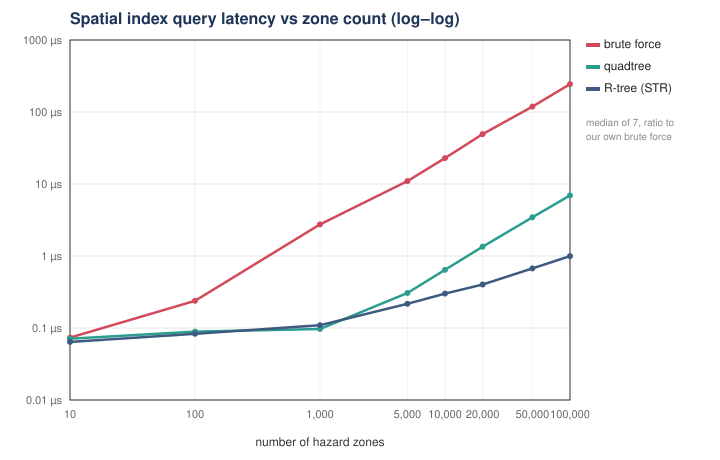

# SafeTrail

**An efficient tourist geofencing engine.** Given many geographic hazard zones
(polygons) and a stream of tourist location updates, it decides — repeatedly, over
time — whether each tourist is **inside, outside, or uncertain** relative to the
hazardous zones, and when they **cross a boundary**. It does this with
**hand-built spatial data structures and computational geometry**, no PostGIS, no
Boost, no spatial library.

> **The one question this project answers:**
> *How much faster can custom spatial data structures make repeated geofencing
> queries, without ever changing the correct result?*

This is a **Data Structures course project**. The data structures are the
deliverable; the simulator, dashboard, and CI exist only to exercise them and
prove they work.

---

## The problem

Repeated geofencing gets expensive as the number of zones grows. The naive method
checks **every zone for every tourist, every tick**:

```
200 tourists × 100,000 zones × 40 vertices  =  800 million geometry ops / tick
```

SafeTrail improves this in three stages, and each stage is a data-structures problem:

1. **Spatial pruning** — a tree returns only the handful of zones near the tourist.
2. **Exact geometry** — point-in-polygon decides the actual answer for those few.
3. **State-transition detection** — emit an event only when containment *changes*.

> **Spatial index finds the candidates; geometry determines the actual answer.**
> That sentence is the whole architecture.

## The solution — five core data structures

The project is built around exactly **five** spatial/temporal structures, all
hand-written, all measured against each other on identical data and queries:

| # | Structure | Problem it solves | Key operation | Complexity |
|---|---|---|---|---|
| 1 | **Brute force** | baseline + correctness oracle | scan all zones | `O(n)` |
| 2 | **Quadtree** | spatial search | range query | `O(log n + k)` avg |
| 3 | **R-tree** | spatial search (compared) | range query | `O(log n + k)` avg |
| 4 | **Interval tree** | temporal filtering | overlap (stab) query | `O(log n + k)` guaranteed |
| 5 | **Persistent quadtree** | historical spatial state | query a past version | `O(log n + k)` avg |

Everything else in the repository is an **extension** built on top of these (see
[the hierarchy](#the-project-in-four-levels) and
[COURSE_MAPPING.md](docs/COURSE_MAPPING.md)).

## How one query works (the hot path)

The canonical flow, per tourist per tick:

```
   tourist location update
            │
            ▼
   ┌──────────────────┐   1. spatial index  (Quadtree / R-tree)   O(log n + k)
   │  candidate zones │      100,000 zones → ~a handful
   └──────────────────┘
            │
            ▼
   ┌──────────────────┐   2. interval tree   "active at time t?"   O(log n + k)
   │  active candidates│
   └──────────────────┘
            │
            ▼
   ┌──────────────────┐   3. exact geometry  ray casting → 3-valued   O(k·V)
   │ inside / outside │      (Inside / Outside / Uncertain);
   │   / uncertain    │      winding number cross-checks it in tests
   └──────────────────┘
            │
            ▼
   ┌──────────────────┐   4. compare with previous state           O(k)
   │ Entered / Exited │      emit an event only on a CHANGE
   │   / Uncertain    │
   └──────────────────┘
```

**Step 1 is the entire performance story.** Everything after it runs on a handful
of candidates instead of all 100,000 zones. The rest is rounding.

## The main experiment — brute force vs quadtree vs R-tree

One dataset, one query workload, three indexes. Full table and caveats in
[docs/RESULTS.md](docs/RESULTS.md) (the single source of truth for every number).
Timings are the **median of 7 passes**; each speedup is a ratio to **our own brute
force**, the correctness oracle — not to an external library.

| zones | brute force | quadtree | R-tree (STR) | quadtree gain | R-tree gain | candidates/query |
|---:|---:|---:|---:|---:|---:|---:|
| 1,000 | 2.75 µs | 0.10 µs | 0.11 µs | 28.4× | 25.1× | 0.97 |
| 10,000 | 22.86 µs | 0.64 µs | 0.30 µs | 35.6× | 76.0× | 9.81 |
| 100,000 | **243.7 µs** | **6.95 µs** | **1.00 µs** | **~35×** | **~240–260×** | **98.78** |



Two results matter more than the raw speedup:

- **Correctness first.** 18,000 randomized queries across three densities,
  **0 mismatches** between each fast index and brute force (`make bench` §2). A fast
  wrong answer is worthless; this is what makes the speedups mean anything.
- **The speedup has a ceiling, and explaining it is the point.** All three indexes
  return the *same* candidate count, because those are true positives. At 100,000
  dense zones ~99 zones genuinely overlap each query, and **no index can return
  fewer results than exist** — the ceiling is output size `k`, exactly as
  `O(log n + k)` predicts. The design doc first guessed ~29,000×; measurement
  disciplined it to ~35×, and understanding *why* is worth more than the big number.

## Time-dependent zones — the interval tree

A static spatial index answers "which zones are *near* here?" It cannot answer
"which zones are *in force* right now?" — hazards turn on and off (a night curfew, a
temporary landslide closure). The **AVL interval tree** stabs the set of validity
windows overlapping time `t` in `O(log n + k)`, *guaranteed* — it is the one
structure on the query path with a real worst-case bound, because it balances on
data, not space. See [docs/DATA_STRUCTURES.md](docs/DATA_STRUCTURES.md).

## Historical queries — the persistent quadtree

*"What hazard-zone configuration was active at 14:32?"* The **persistent
(path-copying) quadtree** answers it. Each mutation copies only the `O(depth)` nodes
on one root-to-leaf path and **shares every untouched subtree** by reference count,
so the whole history is retained for a fraction of the cost of copying the tree per
version — **measured 13.0× structural sharing at 5,001 versions**, and querying the
past is as cheap as querying the present. This is the most advanced structure in the
project.

```
   version 1          version 2 (one zone moved)     version 3 (rule changed)
      root ───────────── root'  (new path only)        root'   (SHARED — a
     / | \ \            /  |  \  \                      / | \ \   validity-only
    A  B  C  D        A'   B   C   D                   A' B  C  D  change copies
       ▲  ▲  ▲   ← B,C,D shared from v1 by refcount        ▲ ▲ ▲   ZERO nodes)
```

## Demo

No dependencies beyond a C++17 compiler.

```bash
make demo        # run the simulation, print the event stream + counters
make bench       # brute force vs quadtree vs R-tree, + correctness gates
make test        # unit, golden and integration tests (~25 s)
make dashboard   # writes dashboard.html — open it, no server needed
```

`make dashboard` produces a single self-contained HTML file (zero network
requests): an animated map over **real OpenStreetMap geography** around Shillong,
Meghalaya, a timeline scrubber, an **index-mode switch** that draws the real cells
of all three indexes (**brute force → quadtree → R-tree**, so you can see the
quadtree's disjoint grid vs the R-tree's overlapping envelopes on the same data),
and a **persistent-index panel** showing consecutive versions with the copied path
highlighted and shared subtrees dimmed — path copying made visible. Full
step-by-step in [docs/DEMO_SCRIPT.md](docs/DEMO_SCRIPT.md).

```bash
make determinism # same seed twice, assert byte-identical output
make check       # every header compiles standalone
make asan        # whole suite under AddressSanitizer + UBSan (Linux/CI)
make ubsan       # whole suite under UBSan only (macOS ASan fallback)
make cmake-build # build a second way, so the two build systems can't drift
```

---

## How to explain this project in 60 seconds

> *"SafeTrail decides whether tourists are entering dangerous zones. The naive way
> checks every zone against every tourist every second — millions of operations. I
> built spatial data structures — a quadtree and an R-tree — that prune 100,000
> zones down to the handful actually near each tourist, then run exact
> point-in-polygon geometry on just those. I proved correctness by comparing every
> fast index against a brute-force oracle over 18,000 randomized queries with zero
> mismatches, and measured a ~35× (quadtree) to ~250× (R-tree) speedup at 100,000
> zones. An interval tree handles zones that turn on and off over time, and a
> persistent version of the quadtree lets me ask what the map looked like at any
> past moment for incident investigation. Everything is hand-written — no spatial
> library — because the structures are the point of the course."*

## Five questions this project answers

1. **Why is brute force too slow?** It is `O(n)` per query — linear in the zone
   count — so cost grows without bound as zones are added. [See §1.](docs/RESULTS.md)
2. **How does a quadtree reduce the work?** It subdivides space so a query descends
   only the branches that can overlap it — `O(log n + k)` on spread data.
3. **Why compare a quadtree *and* an R-tree?** They make opposite trade-offs
   (partition space vs partition items); measuring both on identical data shows the
   R-tree's STR bulk packing winning by ~7×, and *why*.
4. **How do we handle time-varying zones?** An AVL interval tree answers "active at
   time `t`?" in guaranteed `O(log n + k)`.
5. **How can historical states be queried efficiently?** A persistent path-copying
   quadtree shares untouched subtrees across versions — 13× cheaper than full copies.

Full answers to these and 15 more viva questions: [docs/VIVA.md](docs/VIVA.md).

## The project in four levels

The whole repository is organized as a strict hierarchy, so a reader always knows
what is core and what is supporting work:

```
Level 1 — Core problem      Efficient repeated geofencing.
Level 2 — Core structures   Brute force · Quadtree · R-tree · Interval tree
                            · Persistent quadtree.
Level 3 — Core algorithms   Ray casting · Winding number · Segment intersection
                            · State transitions.
Level 4 — Extensions        Groups · Prediction · Offline sync · Merkle log
                            · Routing (Dijkstra/A*) · Dispatch (Hungarian)
                            · Jurisdiction · k-d tree · heap · hash table · …
```

Levels 1–3 are what you present and defend. Level 4 is substantial engineering that
supports the core but is never required to understand it —
[COURSE_MAPPING.md](docs/COURSE_MAPPING.md) maps every module to its level.

## Architecture

```
   Input (tourist fixes) → Zone Store → Spatial Index → Temporal Filter
        → Geometry → State Machine → Event
                                         │
                                         ├──► Extensions (built on the event stream):
                                         │      groups · alerts · dispatch · evidence
                                         └──► one self-contained dashboard.html
```

Layers depend downward only; `ds/` and `geo/` depend on nothing but `types.hpp`.
Full diagram and the hot-loop breakdown: [docs/ARCHITECTURE.md](docs/ARCHITECTURE.md).

## Ground rules

**Every data structure is hand-written.** No `std::unordered_map`, `std::set`,
`std::map`, `std::priority_queue`, no Boost.Geometry, no PostGIS — those are the
structures the course grades, so they are ours. `std::vector`/`std::string` are
permitted as raw storage; `std::sort` is an algorithm, not a structure;
`std::shared_ptr` is the memory management the persistent index's sharing needs.
This is a **deliberate learning constraint**, not a production recommendation.

**The naive baseline is a permanent deliverable.** `BruteForceIndex` stays behind
the same interface as the fast indexes forever. It is the correctness oracle every
index is validated against and the denominator of every speedup number.

**Determinism is non-negotiable.** Fixed seeds, stable tie-breaking, and
`-ffp-contract=off` give byte-identical output across runs of the same scenario —
without it the replay harness is worthless and timing-dependent bugs are unfindable.
See the note below for exactly how far cross-platform reproducibility goes.

## Determinism, precisely

Same seed → byte-identical output on one platform, guaranteed and gated by
`make determinism`. Across operating systems, the **evaluation core is identical**
— same events, same Merkle root, same alerts and index statistics — because a
fixed-seed PRNG, explicit tie-breaks in every ordered structure, and
`-ffp-contract=off` remove every source of drift we control. The one documented
exception is the dispatch travel totals: they take an argmin over haversine costs,
and `asin`/`sin`/`cos` differ in the last ulp between Apple's libm and glibc, which
moves those totals ~3%. Closing that would mean shipping our own transcendental
functions — not a trade worth making — so it is documented instead of hidden.

## Layout

```
include/safetrail/      headers — the design lives here
  index/                ★ CORE: brute force, quadtree, R-tree, persistent index
  ds/                   ★ CORE: interval tree (+ heap, hash table, buffers…)
  geo/                  ★ CORE: containment, ray casting, winding, segments
  graph/                extension: road network, Dijkstra, A*, matching
  group/ alert/         extension: cohesion, triage, correlation
  dispatch/ sync/       extension: assignment, offline reconciliation
  power/ evidence/      extension: adaptive sampling, Merkle log
  jurisdiction/         extension: polygon nesting
  sim/  viz/            harness: simulator, dashboard export
src/                    implementations, mirrors include/
apps/                   headless engine · benchmark binaries
tests/                  per-structure unit tests + golden replays
bench/                  CSV results and the generated scaling chart
docs/                   start with RESULTS.md and VIVA.md
data/  tools/           real OSM zones, road graph; data-prep + plotting scripts
```

## Documents

**Start here for the course project:**

| Doc | What's in it |
|---|---|
| [docs/RESULTS.md](docs/RESULTS.md) | ★ Single source of truth for every measured number |
| [docs/DATA_STRUCTURES.md](docs/DATA_STRUCTURES.md) | ★ The five core structures first, then extensions; invariants, complexity, worst cases |
| [docs/VIVA.md](docs/VIVA.md) | ★ 20 viva questions answered from the actual implementation |
| [docs/PROFESSOR_REVIEW.md](docs/PROFESSOR_REVIEW.md) | ★ Examiner's-eye assessment: likely questions, the hardest one, the weakest area |
| [docs/DEMO_SCRIPT.md](docs/DEMO_SCRIPT.md) | ★ A literal 5-minute demo script — command, screen, what to say |
| [docs/PRESENTATION.md](docs/PRESENTATION.md) | ★ 10-slide walkthrough for your guide |
| [docs/COURSE_MAPPING.md](docs/COURSE_MAPPING.md) | Which DS concept each module demonstrates; CORE vs EXTENSIONS |
| [docs/ARCHITECTURE.md](docs/ARCHITECTURE.md) | The hot loop, data flow, layer responsibilities |

**Deeper / supporting:**

| Doc | What's in it |
|---|---|
| [docs/DESIGN_DEFENSE.md](docs/DESIGN_DEFENSE.md) | The hardest questions, in depth |
| [docs/GEOMETRY_EDGE_CASES.md](docs/GEOMETRY_EDGE_CASES.md) | What breaks in point-in-polygon and how it's handled |
| [docs/DATA_PROVENANCE.md](docs/DATA_PROVENANCE.md) | Where every dashboard number comes from, with verification |
| [docs/GAP_ANALYSIS.md](docs/GAP_ANALYSIS.md) | Why the extensions exist — research on real systems |
| [docs/WALKTHROUGH.md](docs/WALKTHROUGH.md) | Start-to-finish trace of one run |
| [docs/DEPLOYMENT.md](docs/DEPLOYMENT.md) · [TEAM_BRIEF.md](TEAM_BRIEF.md) | Deployment; teammate onboarding |

## Extensions (Level 4 — additional work)

Substantial, tested engineering that supports the core problem without competing
with it. **None is required to understand or defend the five core structures.**

- **Groups & cohesion** — rollback union-find (splits *and* merges; no path
  compression so unions stay undoable).
- **Prediction** — project position forward, retest containment → time-to-boundary.
- **Alert correlation** — spatio-temporal DSU collapses a flood of alerts into one
  incident.
- **Routing & dispatch** — Dijkstra / A* on a real road graph; Hungarian assignment
  for provably optimal responder→incident matching.
- **Offline & evidence** — geohash index serialisation, Lamport-clock
  reconciliation, an RFC 6962 Merkle log (SHA-256 from scratch), QR digital IDs.
- **Adaptive sampling · hysteresis · jurisdiction · k-d tree · binary heap ·
  hash table · timer wheel** — see [DATA_STRUCTURES.md](docs/DATA_STRUCTURES.md).

Origin: this problem is derived from Smart India Hackathon 2025 statement
`SIH25002` (Ministry of DoNER). The extensions each close a documented gap in how
existing systems handle it — [GAP_ANALYSIS.md](docs/GAP_ANALYSIS.md) has the
research — but they are deliberately kept out of the core narrative so the data
structures stay the deliverable.

## Stack

C++17, zero external dependencies anywhere — core, viewer, or build. The dashboard
is one self-contained HTML file with a hand-drawn canvas map (no Leaflet, no tiles,
no CDN, no network). Python 3 is used only for optional data-prep and plotting.
