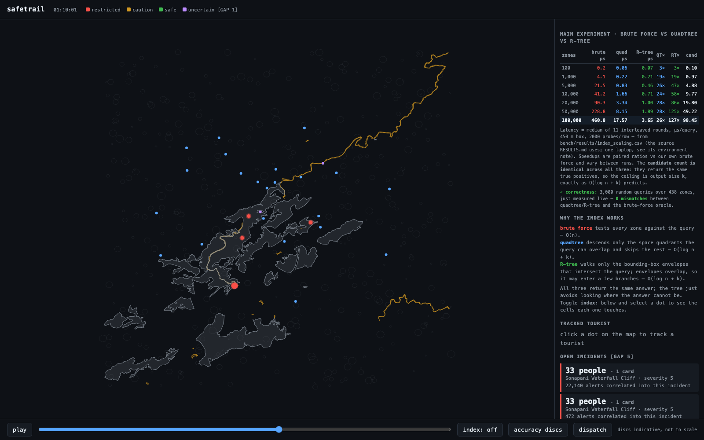
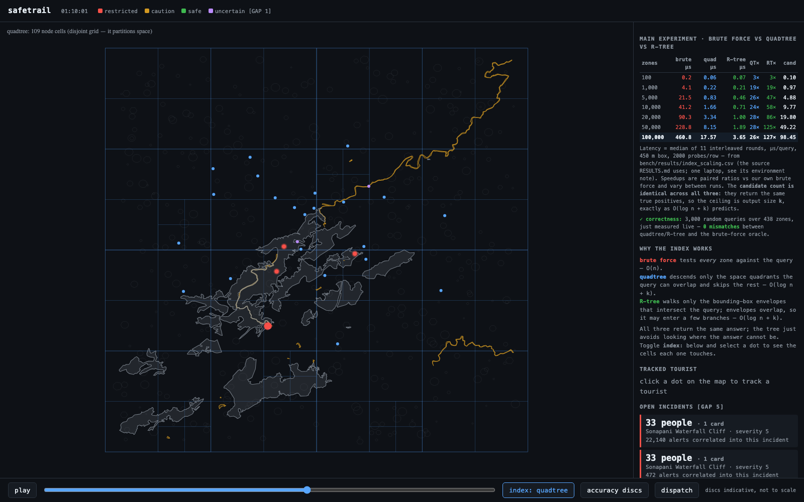
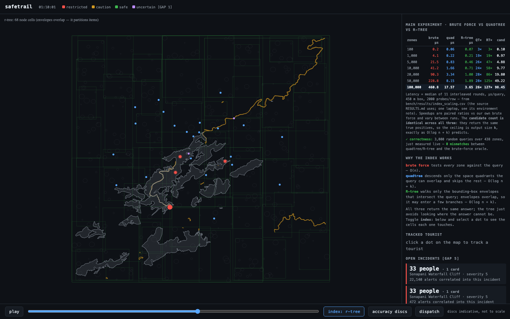

# SafeTrail

**A C++17 geofencing engine built on hand-written spatial and temporal data
structures — and the testing it takes to trust them.**

Given up to 100,000 hazard-zone polygons and a stream of noisy GPS fixes,
SafeTrail decides, fix after fix, whether each person is **inside, outside or
uncertain** relative to every zone near them, and emits an event only when that
changes. Zones switch on and off over time, and every past configuration stays
queryable for incident review.

The challenge is doing that **fast without ever changing the answer**. Checking
every zone against every fix costs O(n·V) per fix. A spatial index cuts the
candidates to the few zones near the fix, and exact geometry then decides those
few. That split is only correct if the index never drops a zone the geometry
would have accepted, and if the per-zone state machine stays truthful when zones
drift in and out of the candidate set. Most of the engineering here is making
those two things true, and showing that they are.

- **Key result (measured):** at 100,000 zones in one district,
  <!-- results:keyline -->the R-tree answers the index query **110× faster** than a linear scan (102–114× over 4 runs) and the quadtree **28.1×** (26.9–28.4×), returning identical results<!-- /results:keyline -->.
- **Correctness (evidence):** every index is compared with a brute-force oracle
  on randomized hostile workloads, with invariant audits after every operation;
  the whole engine must emit identical events under all four indexes; 22 of 22
  injected bugs are caught. This process found ten real defects.
- **Run it:** `make test && make demo && make dashboard` — a C++17 compiler and
  `make`, nothing else.

| Structure | Answers | Bound (theoretical) | Implementation |
|---|---|---|---|
| **Brute force** | which zone boxes meet this box? (the oracle) | O(n) | a scanned vector, kept forever as the baseline |
| **Quadtree** | same, partitioning **space** | O(log n + k) expected; O(n) worst | root fitted to data, doubling expansion, collapse on delete |
| **R-tree** | same, partitioning **items** | O(log n + k) expected; O(n) worst | quadratic split, **STR bulk loading**, condensing delete |
| **AVL interval tree** | which rules are in force at t? | O(log n) to find one; O(min(n, k·log n)) to report k, worst case | max-high augmentation, total-order key |
| **Persistent quadtree** | what were the rules at 14:32? | O(depth) new nodes per change | path copying + append-only validity log |

k is the number of results. No spatial library, no
`std::map`/`set`/`unordered_map`/`priority_queue`, no dependencies beyond a C++17
compiler. [DATA_STRUCTURES.md](docs/DATA_STRUCTURES.md) covers each structure's
invariants and bounds.



<sub>`make dashboard` writes one self-contained HTML file (no server, no network):
real OpenStreetMap zones, simulated tourists, the event stream, and a switch that
draws each index's actual structure on the same data.</sub>

| Quadtree — partitions **space** (disjoint cells) | R-tree — partitions **items** (overlapping envelopes) |
|---|---|
|  |  |

## Measured results (empirical)

Speedups are **paired ratios against this project's own brute force**, shown with
their range over independent runs. Absolute times are one laptop's
(<!-- results:machine -->Apple M4, AC power, load average 4.09 at the start, commit 8d44bc6<!-- /results:machine -->; see
[RESULTS.md](docs/RESULTS.md) for the protocol). Every number is generated from
`bench/results/*.csv`.

<!-- results:headline -->
| Workload | Brute force / naive | Quadtree speedup (range over runs) | R-tree speedup (range over runs) |
|---|---:|---:|---:|
| Range query, 100,000 zones in one district (k ≈ 98) | 560 µs | 28.1× (26.9–28.4×) | 110× (102–114×) |
| Range query, 100,000 zones at constant density (k ≈ 1) | 529 µs | 451× (250–451×) | 817× (513–817×) |
| Point-in-zone, 5,000 polygons × 128 vertices, vs checking every polygon | 609 µs | 1512× (1512–1625×) | 1803× (ratio of medians) |
<!-- /results:headline -->

What the numbers say, and why:

- **The speedup has a ceiling, and it is the answer size.** In one crowded
  district, about 100 zones really do overlap each query at 100,000 zones, and
  every index must return all of them; the quadtree levels off around 23–28×. Hold
  the density constant so each query overlaps about one zone, and the same code
  is hundreds of times faster at 100,000 zones. O(log n + k), measured both ways.
- **The index accelerates the filter, not the geometry.** Against checking every
  polygon, the tree wins by ~200× for 8-vertex polygons and ~2,500× for 512-vertex
  ones; against a plain bounding-box scan followed by the same exact test, by
  ~50× falling to ~14× as polygons get more complex. ([RESULTS.md](docs/RESULTS.md) §3)
- **STR packing matters**: a bulk-loaded R-tree is about 6× faster to query than
  the same R-tree built by insertion at 100,000 zones. (§7)
- **The interval tree wins only when the query is selective**: 14–44× over a
  linear scan for short windows; 0.9–1.3× — no better than the scan — when
  hundreds of windows contain every instant. That is why the engine checks validity in O(1) per candidate
  per tick and uses the tree only for history queries. (§8)
- **Persistence is cheap**: one root-to-leaf path per change (≈15 nodes on a
  5,000-zone index), zero for a rule change, and a query against the past costs
  the same as one against the present. (§9)

## How correctness is established (evidence)

| Method | What it covers |
|---|---|
| **Oracles** | every fast structure has an independent one: brute force for the indexes, a linear scan for the interval tree, a full-table replay for the persistent index, winding number for ray casting, an O(V²) scan for the sweep line |
| **Differential tests** | ~55,000 queries per index over seven hostile workload profiles (identical boxes, zero-area boxes, touching edges, both hemispheres, poles, past lon 180, far inserts), mixed with inserts, removals and rebuilds |
| **Invariant audits** | each core structure's `check_invariants()` runs after **every** operation in those tests |
| **End to end** | the whole engine under all four indexes must emit bit-identical event streams |
| **Mutation testing** | 22 realistic bugs injected into the core; the suite must fail on each (`make mutation`: 22/22) |
| **Sanitizers, warnings, analysis** | the whole suite is UBSan-clean on macOS and gated under ASan + UBSan in Linux CI; `-Werror` builds with clang, and with g++ 13 in CI; Clang Static Analyzer: 0 findings |

This process found **ten defects** in code that was already passing its tests —
eight in the engine, two in how it was measured. One was the state machine never
observing a zone again after it left the candidate window: a missed exit, then a
silent re-entry. Another, in the hysteresis filter, produced about 60% of the
demo's enter/exit events. Each has a regression test that fails on the old code
([DEFECT_LOG.md](docs/DEFECT_LOG.md), [TESTING.md](docs/TESTING.md)).

## Run it

```bash
make test         # 45 test files, ~11,800 checks (~20 s once built)
make demo         # the engine on real OSM zones: event stream + counters
make dashboard    # writes dashboard.html; just open it
make bench        # every benchmark (~2–3 min), regenerates the tables above
make validate     # everything that gates a merge: -Werror, docs, tests,
                  # determinism, sanitizers, CMake + ctest
make mutation     # the mutation check (needs python3)
```

Plain `make` and a C++17 compiler. Developed with Apple clang 17; CI builds with
g++ 13 and clang on Linux and Apple clang on macOS. CMake builds the same source
set from the same flag files (`make cmake-build`). The
dashboard opens `#index=rtree&frame=400` style deep links.

## How it fits together

```
 GPS fix ──► query box ──► spatial index ──► per candidate: in force? ──► exact
 (± accuracy)   (provably      (quadtree /       O(1) validity check        three-valued
                conservative)   R-tree / …)                                  geometry
                                                                               │
 events ◄── transition only on change ◄── hysteresis ◄────────────────────────┘
   │        (+ every zone with open state observed each tick, returned or not)
   └──► extensions: alert correlation → incidents → responder dispatch (Dijkstra/A*,
        Hungarian) · group cohesion · Merkle evidence log · the dashboard
```

The interval tree and the persistent quadtree sit beside this path, answering
historical questions. [ARCHITECTURE.md](docs/ARCHITECTURE.md) has the full
pipeline, the design decisions with their costs, the limitations, and what would
change at production scale.

## Limitations

- **Simulated people, real geography.** OpenStreetMap zones around Shillong,
  Meghalaya; synthetic movement with a GPS error model. No field data.
- **Removal is O(n)** in every spatial index (no id → node map); the quadtree and
  R-tree have O(n) worst-case queries on adversarial data. The interval tree's
  guarantee is O(min(n, k·log n)) for reporting k results — a bound, but not the
  O(log n + k) a centred interval tree would give.
- **Tolerance-based geometry**, not exact predicates (on-edge tolerance ~0.1 mm).
- **No antimeridian support.** Zones crossing ±180° are refused at load, and
  query boxes do not wrap, so a fix at 179.99° cannot see a zone at −179.99°.
- **GPS jumps inflate the query radius.** A jump sits in the 64-fix speed window
  for about a minute, the radius clamps toward 10 km, and pruning collapses for
  that person meanwhile — still correct, just slow.
- **Single-threaded**, one process, in-memory.
- Benchmarks come from one laptop. Ratios transfer far better than absolute times,
  and even ratios move between runs, which is why they're quoted as ranges.

## Documentation

| | |
|---|---|
| [ARCHITECTURE.md](docs/ARCHITECTURE.md) | pipeline, layers, design decisions, limitations, production changes |
| [DATA_STRUCTURES.md](docs/DATA_STRUCTURES.md) | each structure: design, invariants, bounds (guaranteed vs expected) |
| [RESULTS.md](docs/RESULTS.md) | every benchmark, the protocol, the environment, run-to-run ranges |
| [TESTING.md](docs/TESTING.md) | oracles, differential tests, invariants, mutation results, sanitizers |
| [GEOMETRY_EDGE_CASES.md](docs/GEOMETRY_EDGE_CASES.md) | what breaks point-in-polygon and polygon validation, and the tolerances |
| [DEFECT_LOG.md](docs/DEFECT_LOG.md) | every real defect found, its fix, and the test that pins it |
| [INTERVIEW.md](docs/INTERVIEW.md) · [RESUME.md](docs/RESUME.md) | the project explained at 30 s / 60 s / 3 min, and résumé bullets with sources |
| [GAP_ANALYSIS.md](docs/GAP_ANALYSIS.md) · [DATA_PROVENANCE.md](docs/DATA_PROVENANCE.md) · [DEPLOYMENT.md](docs/DEPLOYMENT.md) | why the extensions exist; where the dashboard's data comes from; CI and Pages |
| [docs/course/](docs/course/README.md) | the original course submission (viva prep, slides), archived |

SafeTrail started as a Data Structures course project derived from Smart India
Hackathon 2025 problem SIH25002 (Ministry of DoNER).
