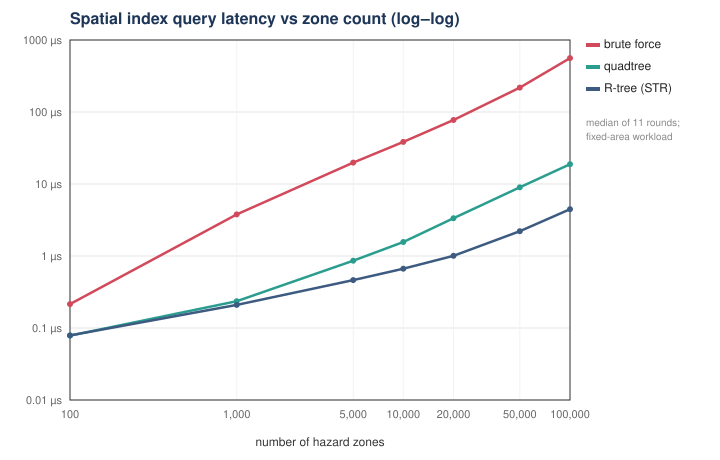

# Results

Every table on this page is **generated** from `bench/results/*.csv` by
`tools/render_results.py`; none is typed by hand. `make bench` writes the CSVs
and regenerates the tables, `make bench-variation` adds repeat runs for the
ranges, and CI fails if a committed table disagrees with the committed CSVs.

```bash
make bench             # every section below (~2–3 min), then re-render
make bench-variation   # sections 1-3 three more times, for the ranges
```

## Read this first

- **What is portable and what is not.** Absolute times belong to one machine in
  one state — the environment below records which, including power source and
  load (this run: <!-- results:machine -->Apple M4, AC power, load average 4.09 at the start, commit 8d44bc6<!-- /results:machine -->). They
  drift between sessions: brute force over 100,000 zones measured 244 µs in a
  12 September run and 460–560 µs across the committed runs below, on battery
  and on mains alike, for reasons not established. Ratios measured back to back,
  candidate counts, node counts, allocation counts and bytes are far more
  stable, so the docs quote ratios, with their range.
- **Ranges are real.** Even paired, a speedup moves between runs: the R-tree's
  at 100,000 zones spanned 102–114× across the runs below, and 97–229× in the
  previous committed set. Two later clean-clone validation runs of the same code
  (not committed) measured brute force at 241 and 287 µs and the R-tree at 236×
  and 206×: the committed runs are the slow end of what this laptop does. Every
  headline ratio is shown with the min–max over
  <!-- results:runs -->4<!-- /results:runs --> independent runs.
- **Speedups are against this project's own brute force**, the correctness
  oracle — not against PostGIS, Boost.Geometry or any library.
- **Simulated people, real geography.** Benchmarks use synthetic zones in a
  real district's extent; the engine's end-to-end runs use real OpenStreetMap
  zones around Shillong with simulated tourists (simulation provides ground
  truth).
- **Every comparison is also a correctness gate.** Contenders that do the same
  job return a checksum of their results; the run fails if any differ.

<!-- results:env -->
```
date:     2026-09-28T10:37Z
commit:   8d44bc6
compiler: Apple clang version 17.0.0 (clang-1700.4.4.1)
flags:    -std=c++17 -O2 -ffp-contract=off
os:       Darwin 25.5.0 arm64
cpu:      Apple M4
cores:    10
power:    AC Power
load:     4.09 4.88 6.84
```
<!-- /results:env -->

### Protocol

Query boxes are built before timing, so a query time is index traversal only.
One *sample* runs the whole probe set enough times to last at least 20 ms
(calibrated per contender after an untimed warm-up); **11 rounds**, each
contender taking one sample per round in an order rotated round to round, so
drift lands on every contender rather than on whichever ran last. Reported:
the median, and the interquartile range as a percentage of it. A **speedup is
paired**: the median over rounds of *baseline ÷ contender* measured back to
back. On macOS the process requests the performance cores (QoS
user-interactive); that is a request, and the pairing is what keeps ratios
meaningful if it is not honoured. The previous protocol — the median of 7
passes of ~2 ms each, one index after another — is what produced headline
numbers this protocol could not reproduce ([DEFECT_LOG.md](DEFECT_LOG.md),
pass 6).

---

## 1. Scaling in one district — k grows with n

2,000 random 450 m query boxes against n zones (boxes 60–480 m across) in one
39 × 35 km district. Because the area is fixed, the number of zones genuinely
overlapping each query, **k**, grows in proportion to n.

<!-- results:scaling -->
| zones | brute µs | quadtree µs | R-tree µs | quadtree × | R-tree × | k / query | quadtree × range | R-tree × range | worst IQR |
|---:|---:|---:|---:|---:|---:|---:|---:|---:|---:|
| 100 | 0.215 | 0.079 | 0.079 | **2.72×** | **2.73×** | 0.10 | 2.57–3.47× | 2.68–2.87× | 4% |
| 1,000 | 3.79 | 0.235 | 0.210 | **16.2×** | **18.2×** | 0.97 | 15.3–16.2× | 17.9–19.6× | 10% |
| 5,000 | 19.8 | 0.862 | 0.463 | **23.8×** | **43.6×** | 4.88 | 22.9–27.2× | 39.6–51.7× | 24% |
| 10,000 | 38.5 | 1.57 | 0.665 | **24.9×** | **58.3×** | 9.77 | 24.4–25.6× | 58.1–68.6× | 10% |
| 20,000 | 77.5 | 3.35 | 1.01 | **24.6×** | **76.8×** | 19.80 | 24.6–26.2× | 74.7–83.6× | 14% |
| 50,000 | 218 | 9.00 | 2.21 | **24.0×** | **91.1×** | 49.22 | 24.0–26.9× | 91.1–120× | 49% |
| 100,000 | 560 | 18.8 | 4.47 | **28.1×** | **110×** | 98.45 | 26.9–28.4× | 102–114× | 58% |
<!-- /results:scaling -->

Brute force is linear. The trees are O(log n + k) and here **k dominates**: at
100,000 zones about a hundred zones really do overlap each query, and every
index must return all of them. That caps the speedup — no index returns fewer
results than exist — and it is why the quadtree's ratio levels off around
23–28× instead of growing. The R-tree keeps gaining because STR packing lets it
reach those k results through fewer nodes. The candidate counts are identical
across indexes by construction; the checksum gate verifies it on every row.



## 2. Scaling at constant density — k held near 1

The same experiment with the district's area growing in proportion to n, so
each query overlaps about one zone at every size.

<!-- results:density -->
| zones | brute µs | quadtree µs | R-tree µs | quadtree × | R-tree × | k / query | quadtree × range | R-tree × range | worst IQR |
|---:|---:|---:|---:|---:|---:|---:|---:|---:|---:|
| 1,000 | 5.05 | 0.225 | 0.227 | **20.1×** | **16.7×** | 0.97 | 15.6–26.0× | 16.7–23.1× | 212% |
| 10,000 | 53.7 | 0.449 | 0.310 | **115×** | **178×** | 1.03 | 57.1–115× | 85.4–178× | 15% |
| 100,000 | 529 | 1.20 | 0.638 | **451×** | **817×** | 0.99 | 250–451× | 513–817× | 25% |
<!-- /results:density -->

With k fixed, what is left is the tree's depth, and the speedup keeps rising
with n — hundreds of times at 100,000 zones. Sections 1 and 2 together are the
honest answer to "how does it scale?": the index removes the O(n) scan; it
cannot remove the answer.

## 3. End to end — "which zones contain this point?"

The question the engine actually asks for each GPS fix, answered four ways that
must return the same set: **naive** ray-casts every polygon (O(n·V));
**bbox scan** tests every zone's box and ray-casts the hits (the brute-force
index plus exact geometry); **quadtree** and **R-tree** filter with the tree
first. 5,000 star-shaped polygons in the district, 300 probe points, V vertices
per polygon.

<!-- results:e2e -->
| V | naive µs | bbox scan µs | quadtree µs | R-tree µs | quadtree vs naive | range | quadtree vs scan | range | candidates / q | hits / q |
|---:|---:|---:|---:|---:|---:|---:|---:|---:|---:|---:|
| 8 | 63.6 | 19.0 | 0.340 | 0.207 | **198×** | 182–198× | 56.2× | 52.5–56.2× | 0.18 | 0.11 |
| 32 | 271 | 23.8 | 0.482 | 0.343 | **582×** | 533–634× | 51.2× | 41.4–54.8× | 0.30 | 0.18 |
| 128 | 609 | 21.8 | 0.377 | 0.338 | **1512×** | 1512–1625× | 49.8× | 29.5–49.8× | 0.28 | 0.16 |
| 512 | 3921 | 22.8 | 1.56 | 1.33 | **2502×** | 2435–2784× | 14.1× | 10.6–14.1× | 0.34 | 0.16 |
<!-- /results:e2e -->

The large factors against *naive* are what "check every zone against every
tourist" really costs. A plain bounding-box scan already removes the V; the
tree then removes the n. The exact test on the few candidates is identical in
every column, which is why the tree's advantage over the scan shrinks as V
grows — it accelerates the filter, not the refinement.

## 4. Build, memory, updates

Build is the median of 5. Memory is `IndexStats::bytes`: nodes plus the
capacity of every vector they own, allocator overhead excluded. Insert and
remove are the median over 7 rounds of 1,000 operations on a freshly built
index.

<!-- results:costs -->
| zones | index | build ms | memory KB | bytes / zone | insert µs | remove µs |
|---:|---|---:|---:|---:|---:|---:|
| 10,000 | brute-force | 0.02 | 391 | 40 | 0.009 | 10.7 |
| 10,000 | quadtree | 2.29 | 699 | 72 | 0.321 | 24.9 |
| 10,000 | r-tree | 4.00 | 527 | 54 | 1.76 | 29.8 |
| 100,000 | brute-force | 0.35 | 3,906 | 40 | 0.017 | 239 |
| 100,000 | quadtree | 31.90 | 6,618 | 68 | 0.304 | 393 |
| 100,000 | r-tree | 47.26 | 5,255 | 54 | 2.27 | 374 |
<!-- /results:costs -->

Removal is O(n) in all three indexes: none keeps an id → node map, so the entry
is found by search, and the trees then pay again to collapse or condense. That
is a deliberate simplification for a read-heavy workload, measured rather than
hidden; an id → leaf hash map is the first change for a churn-heavy one.

## 5. Equivalence

`make bench` §5 checks every index against brute force on 18,000 queries at
three radii and three densities; `tests/index/differential_test.cpp` runs about
275,000 more over seven hostile workload profiles with structural audits after
every operation ([TESTING.md](TESTING.md)). Zero mismatches in both.

## 6. Two point-in-polygon implementations

Ray casting vs winding number: 100,000 points against 200 random concave
polygons, **0 disagreements** (`make bench` §6; holes in every orientation are
covered by `tests/geo/polygon_holes_test.cpp`).

## 7. R-tree bulk loading — STR vs repeated insertion

Same data, same queries; only the way the tree was assembled changes.

<!-- results:str -->
| zones | insertion build ms | STR build ms | insertion nodes | STR nodes | insertion µs / query | STR µs / query | STR query gain |
|---:|---:|---:|---:|---:|---:|---:|---:|
| 1,000 | 0.4 | 0.3 | 214 | 155 | 0.478 | 0.227 | **2.08×** |
| 10,000 | 5.7 | 3.1 | 2,133 | 1,456 | 3.38 | 0.691 | **4.92×** |
| 100,000 | 97.8 | 43.0 | 21,368 | 14,383 | 27.3 | 4.38 | **6.12×** |
<!-- /results:str -->

Both builds are O(n log n). STR produces a smaller tree whose sibling boxes
overlap less, so a query enters fewer branches — the structure, not the machine.

## 8. Interval tree — stabbing vs a linear scan

"Which validity windows contain instant t?", in two regimes. **Selective**:
windows of 1–30 minutes spread over 30 days. **Dense**: a tenth as many start
times as windows, each lasting up to 4 hours, so hundreds contain any instant.
Churn: ten rounds of deleting and reinserting a tenth of the set.

<!-- results:interval -->
| regime | windows | scan µs | tree µs | tree × | k / stab | height | AVL bound | height after churn | delete µs |
|---|---:|---:|---:|---:|---:|---:|---:|---:|---:|
| selective | 1,000 | 1.13 | 0.080 | **14.1×** | 0.3 | 12 | 14.0 | 12 | 0.273 |
| selective | 10,000 | 11.3 | 0.255 | **44.3×** | 3.6 | 16 | 18.8 | 16 | 0.317 |
| selective | 100,000 | 132 | 4.58 | **28.4×** | 36.0 | 20 | 23.6 | 20 | 1.29 |
| dense | 1,000 | 4.00 | 4.14 | **0.97×** | 363.2 | 12 | 14.0 | 12 | 0.252 |
| dense | 10,000 | 24.4 | 25.9 | **0.94×** | 980.5 | 16 | 18.8 | 16 | 0.539 |
| dense | 100,000 | 170 | 150 | **1.34×** | 1192.3 | 20 | 23.6 | 20 | 1.02 |
<!-- /results:interval -->

Selective windows are where the `max_high` augmentation earns its keep. With
hundreds of windows containing every instant the tree must still visit and
report each one, and a sequential scan is as fast: the same O(k) ceiling as the
spatial indexes. Height stays under the AVL bound for the *live* size after
churn. (This is also why the engine does **not** use the interval tree per tick:
it checks validity in O(1) on the few candidates the spatial index returned.)

## 9. Persistent quadtree — path copying

Zones added one version at a time; "if full-copied" is what a copy-the-tree-per-
version scheme would have allocated. Then the cost of each kind of mutation on a
5,000-zone index.

<!-- results:persistent -->
| versions | nodes allocated | if full-copied | sharing | query @ past µs | query @ now µs |
|---:|---:|---:|---:|---:|---:|
| 51 | 523 | 1,903 | **3.6×** | 0.215 | 0.211 |
| 201 | 2,582 | 14,633 | **5.7×** | 0.302 | 0.274 |
| 1,001 | 14,025 | 158,257 | **11.3×** | 0.585 | 0.579 |
| 5,001 | 71,314 | 930,257 | **13.0×** | 2.00 | 2.70 |

| mutation (5,000-zone index) | nodes allocated, mean | max |
|---|---:|---:|
| add (new zone) | 14.7 | 15 |
| replace (moved zone) | 29.0 | 30 |
| validity change | 0.0 | 0 |
| remove | 14.3 | 15 |
<!-- /results:persistent -->

Sharing grows with history, a query against the past costs what one against the
present does (a different root pointer, no replay), and each mutation copies one
root-to-node path — a validity change copies nothing.

---

## Extensions (§10–17)

Built on the core; not part of the headline claim. Full tables are in the CSVs
named after each section.

<!-- results:extensions -->
| Extension | § | Measured |
|---|---|---|
| Hysteresis A/B | §10 | white noise (rho=0): filter removes 100.9% of the naive run's excess transitions and reports 343 vs 521 that noise-free fixes give under the same policy; realistic drift (rho=0.9): filter removes 100.1% of the naive run's excess transitions and reports 502 vs 521 that noise-free fixes give under the same policy |
| A* vs Dijkstra | §11 | 77.7% fewer nodes settled at 1,024 nodes, same path |
| Hungarian vs greedy dispatch | §12 | 15.7% less total travel at 40 responders; never worse in any of 200 layouts |
| Adaptive GPS sampling | §13 | 28,800 → 257 fixes over an 8 h trek (99.1% fewer) at 100.0% near-zone recall |
| Index churn (20 × add/remove 2,000) | §14 | quadtree 1.00×, r-tree 1.57×, geohash 1.00×, hash_table 1.00× node count vs fresh |
| Geohash serialisation | §15 | 44 bytes / zone; 100,000 zones read in 1.12 ms |
| Shamos–Hoey vs pairwise validation | §16 | sweep first wins at 64 vertices; 6.44× at 2,048; verdicts agree on every ring |
| k-d tree vs linear snap | §17 | 49.3× at 10,000 junctions, same node every time |
<!-- /results:extensions -->

## Test suite and verification

Not benchmarks, but the numbers people ask for next — see
[TESTING.md](TESTING.md) for what each means. The suite is
`make test`; the whole of it runs under UBSan locally and ASan + UBSan in Linux
CI; `make mutation` kills 22 of 22 injected bugs; `make determinism` checks
byte-identical output for a fixed seed.
